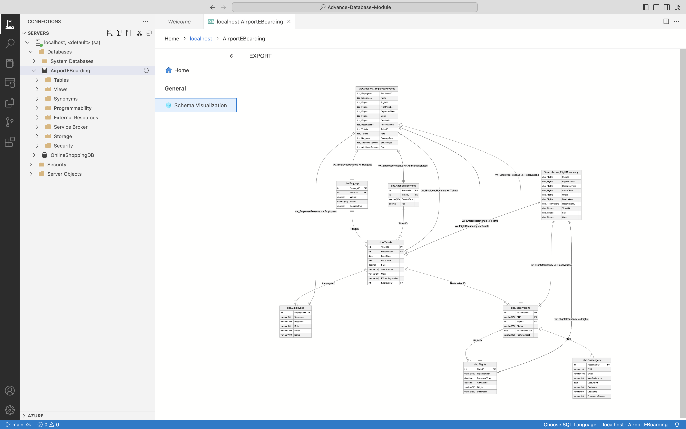

# Airport E-Boarding Database

End-to-end relational database for airport e-boarding: passengers, flights, reservations, ticketing, baggage, and add-on services. Schema is normalized to **3NF**, with production-style T-SQL objects (views, stored procedures, functions, triggers) and a **Docker** setup so reviewers can run it locally in minutes.

## At a glance

| | |
|---|---|
| **Problem** | Model and implement persistent data for airport check-in: who is flying, on which flight, with what ticket, baggage, and extras. |
| **Approach** | Entity-relationship design → 3NF tables → constraints and transactional procedures → reporting views and operational triggers. |
| **Stack** | Microsoft SQL Server 2019, T-SQL, Docker Compose, Azure Data Studio / SSMS |



## What this demonstrates

- **Data modeling:** Seven related tables, PK/FK relationships, check constraints (e.g. reservation date not in the past).
- **Normalization:** Documented 1NF → 2NF → 3NF design; no redundant passenger/flight data on tickets.
- **T-SQL depth:** Views, stored procedures (search, inserts, updates, reporting), scalar/table functions, triggers.
- **Integrity:** `TRY/CATCH`, transactions in procedures, validation before writes.
- **Queries:** Joins and subqueries (e.g. pending reservations for passengers over 40).
- **Ops awareness:** Notes on concurrency, security, and backup in [airport_eboarding_documentation.md](airport_eboarding_documentation.md).

## Quick start

**Prerequisites:** [Docker Desktop](https://www.docker.com/products/docker-desktop/), [Azure Data Studio](https://azure.microsoft.com/products/data-studio/) or SSMS.

```bash
git clone https://github.com/Asif-shah786/airport-eboarding-database.git
cd airport-eboarding-database
docker compose up -d
```

Wait ~20–30 seconds for SQL Server to accept connections, then connect:

| Setting | Value |
|---------|--------|
| Server | `localhost,1433` |
| Authentication | SQL Login |
| User | `sa` |
| Password | `YourStrong!Passw0rd` *(local dev only)* |

Open and run **[airport_eboarding.sql](airport_eboarding.sql)**. It drops/recreates `AirportEBoarding`, creates all objects, seeds sample data, and runs test calls at the end.

## Repository layout

| File | Purpose |
|------|---------|
| [airport_eboarding.sql](airport_eboarding.sql) | Full database script (schema, data, objects, tests) |
| [airport_eboarding_documentation.md](airport_eboarding_documentation.md) | Design rationale, implementation walkthrough, security/backup notes |
| [design-spec.md](design-spec.md) | Domain model and object inventory |
| [database-diagram.png](database-diagram.png) | ER diagram |
| [docker-compose.yml](docker-compose.yml) | SQL Server 2019 container |

## Schema overview

**Tables:** `Employees`, `Passengers`, `Flights`, `Reservations`, `Tickets`, `Baggage`, `AdditionalServices`

**Highlighted objects**

| Type | Name | Role |
|------|------|------|
| View | `vw_EmployeeRevenue` | Revenue and e-boarding numbers per employee |
| View | `vw_FlightOccupancy` | Seat usage and flight revenue |
| Procedure | `sp_SearchPassengersByLastName` | Passenger lookup, newest ticket first |
| Procedure | `sp_ListBusinessClassPassengersToday` | Today’s business passengers and meal prefs |
| Procedure | `sp_InsertNewEmployee` / `sp_UpdatePassengerDetails` | Validated writes |
| Procedure | `sp_GetPassengerTravelHistory` | Full travel history by PNR |
| Function | `fn_CalculateCheckedInBaggage` | Checked-in baggage by flight and date |
| Trigger | `trg_UpdateSeatStatus` | Seat status when a ticket is issued |

## Capabilities

- Passenger, flight, reservation, and ticket lifecycle
- E-boarding numbers, fares, seat classes, baggage fees
- Extra services (preferred seat, upgraded meal, extra baggage)
- Employee-linked ticket issuance and revenue reporting
- Sample dataset and executable tests at the bottom of `airport_eboarding.sql`

## Troubleshooting

**Cannot connect**

- Confirm Docker is running: `docker ps` (container `sqlserver2019` should be up).
- Port `1433` must be free on your machine.

**Script fails on re-run**

- `airport_eboarding.sql` drops `AirportEBoarding` if it exists, then recreates it. Re-run the full script rather than partial sections.

**Reset environment**

```bash
docker compose down -v
docker compose up -d
```

Then run `airport_eboarding.sql` again.

## Further reading

- [airport_eboarding_documentation.md](airport_eboarding_documentation.md) — normalization, object-by-object explanation, testing, recommendations.
- [design-spec.md](design-spec.md) — tables, constraints, and required behaviors in one place.

## License

[MIT](LICENSE)
